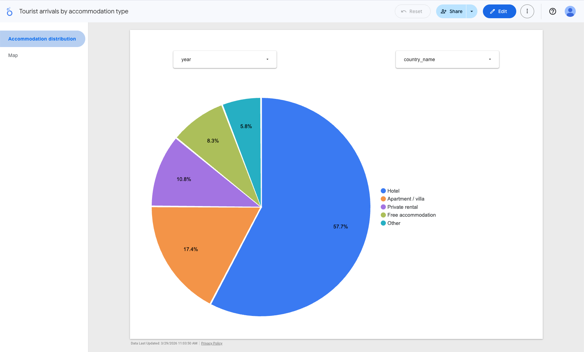
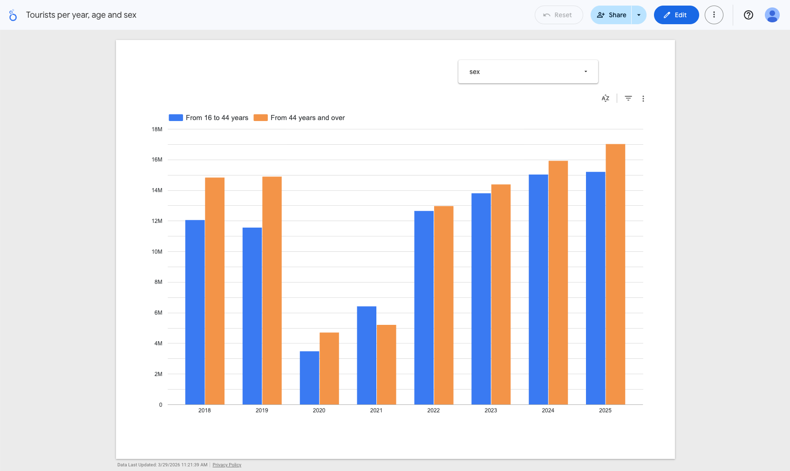

# Data Engineering Zoomcamp Project: Tourism in Canary Islands

## Problem description

The Canary Islands are one of the most visited destinations in Europe, receiving over 13 million tourists per year. Understanding *who* visits, *how* they travel, and *when* demand fluctuates is essential for regional planning, hospitality investment, and tourism policy.

The regional statistical institute (ISTAC) publishes quarterly open data on tourist volumes, accommodation choices, country of origin, demographics (age & sex), and economic revenue — but the raw data is hard to query and not connected to any analytical system.

**This project answers two concrete questions:**
1. What share of tourists choose each accommodation type (hotels, apartments, private rentals…), and how does this vary by country of origin?
2. How has the age and sex profile of tourists changed year over year, including the impact of COVID-19?

To answer these questions reliably and repeatedly, the project builds an end-to-end **batch data pipeline** that:

1. **Ingests** the three ISTAC open-data CSVs (accommodations, age/sex, revenue) on a quarterly schedule.
2. **Transforms** the raw data with PySpark — normalises column names, casts types, and produces Parquet files partitioned by year.
3. **Stores** raw CSVs and processed Parquet in Google Cloud Storage (data lake).
4. **Loads** the Parquet into BigQuery (`tourism_raw.*`), with MONTH partitioning on `period_date` and clustering on the most-queried dimensions.
5. **Models** the data with dbt: staging views clean, rename fields, and map coded type and by demographic group, excluding subtotals and annual-only rows.
6. **Visualises** two key questions in a Looker Studio dashboard:
   - What share of tourists use each accommodation type, and how does it vary by country?
   - How does the age and sex breakdown of tourists change year over year?

The full pipeline is orchestrated by Kestra and scheduled to run on the first day of each quarter.

---

## Architecture

```
ISTAC API
   │
   ▼
ingestion/download.py  ──►  data/raw/*.csv
                                │
                                ▼
                     ingestion/upload_gcs.py  ──►  GCS: tourism-raw/  (CSV)
                                │
                                ▼
                  processing/spark_transform.py
                     (local PySpark, local[*])
                                │
                                ▼
                          data/processed/*
                                │
                                ▼
                     ingestion/upload_gcs.py  ──►  GCS: tourism-processed/  (Parquet)
                                │
                                ▼
                     ingestion/load_bigquery.py
                                │
                                ▼
                    BigQuery: tourism_raw.*
                     (partitioned + clustered)
                                │
                                ▼
                           dbt run
                      tourism_staging.*  (views)
                      tourism_mart.*     (tables)
                                │
                                ▼
                       Looker Studio dashboard
```

**Cloud:** Google Cloud Platform (GCS + BigQuery)  
**IaC:** Terraform  
**Orchestration:** Kestra (Docker Compose)  
**Transformation:** PySpark 3.5 (batch) + dbt 1.7 (SQL)  

---

## Tech stack

| Layer | Tool |
|---|---|
| Language | Python 3.11 + uv |
| IaC | Terraform ~5.0 |
| Data lake | Google Cloud Storage |
| Data warehouse | BigQuery |
| Batch processing | PySpark 3.5 |
| SQL modelling | dbt-bigquery 1.7 |
| Orchestration | Kestra (Docker Compose) |
| Dashboard | Looker Studio |

---

## Reproducing the project

### Prerequisites

- Python 3.11 and [uv](https://docs.astral.sh/uv/) installed
- [Terraform](https://developer.hashicorp.com/terraform/install) ≥ 1.6
- [Docker Desktop](https://www.docker.com/products/docker-desktop/) running
- Java 11+ on `PATH` (required by PySpark)
- A GCP project with billing enabled

#### GCP initial setup (once per project)

**1. Enable the required APIs** — before creating a service account:

```bash
gcloud config set project <your-gcp-project-id>

gcloud services enable \
  cloudresourcemanager.googleapis.com \
  iam.googleapis.com \
  storage.googleapis.com \
  bigquery.googleapis.com
```

Or via the GCP Console: **APIs & Services → Enable APIs and Services**, search for and
enable: *Cloud Resource Manager API*, *Identity and Access Management (IAM) API*,
*Cloud Storage API*, *BigQuery API*.

**2. Create an admin service account and download the key:**

```bash
gcloud iam service-accounts create terraform-admin \
  --display-name "Terraform admin SA"

gcloud projects add-iam-policy-binding <your-gcp-project-id> \
  --member="serviceAccount:terraform-admin@<your-gcp-project-id>.iam.gserviceaccount.com" \
  --role="roles/owner"

gcloud iam service-accounts keys create credentials/service_account.json \
  --iam-account="terraform-admin@<your-gcp-project-id>.iam.gserviceaccount.com"
```

This key is used only by Terraform to provision resources. The pipeline uses a separate
SA key (`credentials/pipeline_sa.json`) that Terraform creates automatically.

### 1 — Clone & install dependencies

```bash
git clone <repo-url>
cd data-engineer-final-project-tourism-in-canary-islands
uv sync
```

### 2 — Configure environment

Copy the example and fill in your values:

```bash
cp .env.example .env   # then edit .env
```

Minimum required variables in `.env`:

```dotenv
GCP_PROJECT_ID=<your-gcp-project-id>
GCS_RAW_BUCKET=<project-id>-tourism-raw
GCS_PROCESSED_BUCKET=<project-id>-tourism-processed
BQ_DATASET_RAW=tourism_raw
BQ_DATASET_STAGING=tourism_staging
BQ_DATASET_MART=tourism_mart
GCP_REGION=europe-west1
GOOGLE_APPLICATION_CREDENTIALS=credentials/pipeline_sa.json
```

### 3 — Provision cloud resources with Terraform

```bash
cd terraform
cp terraform.tfvars.example terraform.tfvars   # fill in project_id
terraform init
terraform apply
cd ..
```

This creates:
- GCS buckets: `tourism-raw` and `tourism-processed`
- BigQuery datasets: `tourism_raw`, `tourism_staging`, `tourism_mart`
- Service account `tourism-pipeline` with Storage + BigQuery admin roles
- Pipeline SA key written to `credentials/pipeline_sa.json`

### 4 — Run the pipeline manually (step by step)

> **Skip this step if you plan to use Kestra (step 6)** — the Kestra flow runs all these commands automatically.

```bash
# Download raw CSVs from ISTAC API
uv run main.py ingest

# PySpark transformation → data/processed/
uv run main.py transform

# Upload to GCS (raw CSVs + processed Parquet)
uv run main.py upload

# Load Parquet from GCS into BigQuery (tourism_raw.*)
uv run main.py load
```

### 5 — Run dbt models (optional if using Kestra)

> **If using Kestra (step 6):** skip this step entirely. The dbt profile is bundled
> in `dbt/profiles.yml` and reads `GCP_PROJECT_ID` / `GCP_REGION` /
> `GOOGLE_APPLICATION_CREDENTIALS` from the environment automatically.

To run dbt manually:

```bash
cd dbt
dbt run           # creates staging views + mart tables
dbt test          # optional: run schema tests
cd ..
```

The profile at `dbt/profiles.yml` uses environment variables — make sure they are
exported in your shell (or `source .env`) before running dbt locally:

```bash
export GCP_PROJECT_ID=<your-gcp-project-id>
export GCP_REGION=europe-west1
export GOOGLE_APPLICATION_CREDENTIALS=/absolute/path/to/credentials/pipeline_sa.json
```

### 6 — Run the full pipeline via Kestra

```bash
docker compose up -d
```

Then open **http://localhost:8080**.

First time: Kestra shows a setup wizard — create your admin user (e.g.
`admin@kestra.io` / `Admin1234`).

1. Go to **Flows** and confirm `canary-islands-tourism-pipeline` (namespace `tourism`)
   is listed. If it is not, click **+** → paste the contents of `kestra/pipeline.yml`
   → **Save**.
2. To trigger a manual run: open the flow → **Execute** → **Execute now**.
3. The quarterly schedule triggers automatically on Jan 1, Apr 1, Jul 1, Oct 1 at 06:00 UTC.

---

## Dashboard

The Looker Studio dashboard connects to the `tourism_mart` BigQuery dataset and answers two analytical questions about tourism in the Canary Islands (2018–2025).

**Access:** [Looker Studio dashboard](https://lookerstudio.google.com) ← add your link here

### Chart 1 — Tourist arrivals by accommodation type (pie chart)

Shows the **percentage share** of total tourist arrivals (2018–present) split by accommodation category: Hotel, Apartment / villa, Private rental, Free accommodation, and Other.

- Data source: `tourism_mart.mart_tourists_by_accommodation`
- Chart type: Pie chart
- Dimension: `accommodation_category`
- Metric: `SUM(total_tourists)`
- Filters: **year** selector (drop-down) · **country_name** selector (drop-down)



> Rows with `accommodation_type_code = '_T'` (totals) and `country_code = '_T'`
> are excluded at the dbt mart layer to avoid double counting.

### Chart 2 — Tourists per year by age group & sex (vertical bar chart)

Shows the **number of tourists per year** grouped by age group
(`From 16 to 44 years` / `From 44 years and over`).

- Data source: `tourism_mart.mart_tourists_by_demographics`
- Chart type: Vertical bar chart
- Dimension: `year`
- Breakdown dimension: `age_group`
- Metric: `SUM(total_tourists)`
- Filter: **sex** selector (drop-down: Male / Female)



We can see how the year of COVID is reflected and, interestingly, how the following year there was the unique circumstance that the number of tourists under 44 years of age was greater than that of those over 44 years of age.

---

## Data warehouse design

All BigQuery tables in `tourism_raw.*` are **partitioned by `period_date` (MONTH)** and
**clustered** on the most-queried filter columns.

| Table | Clustering columns | Rationale |
|---|---|---|
| `tourist_accommodations` | `territorio_code`, `tipo_alojamiento_code`, `pais_residencia_code` | Dashboard filters by territory and accommodation type; country is a common WHERE clause |
| `tourist_age_sex` | `territorio_code`, `sexo_code`, `edad_code` | Demographic queries always filter by sex and age group |
| `tourist_revenue` | `territorio_code`, `medidas_code` | Revenue queries are almost always scoped to a territory and measure type |

**Why MONTH partitioning on `period_date`?**  
The data is quarterly but stored as the first day of each quarter (a DATE). Month
granularity is the finest that avoids partition proliferation while still allowing
BigQuery's partition pruning to skip irrelevant quarters when filtering by date range
(e.g. `WHERE period_date BETWEEN '2020-01-01' AND '2021-12-31'`).

**Why these clustering columns?**  
All dashboard queries filter by territory (Canary Islands vs sub-regions), and the two main analytical dimensions are accommodation type and demographic segment (sex + age group). Clustering on these columns means BigQuery scans the minimum number of blocks for each query, reducing both cost and latency.

---

## Project structure

```
.
├── credentials/          # GCP service account keys (gitignored)
├── data/
│   ├── raw/              # Downloaded CSVs (gitignored)
│   └── processed/        # PySpark Parquet output (gitignored)
├── dbt/
│   ├── models/
│   │   ├── staging/      # Views: stg_tourist_accommodations, stg_tourist_age_sex, stg_tourist_revenue
│   │   └── mart/         # Tables: mart_tourists_by_accommodation, mart_tourists_by_demographics
│   ├── macros/
│   │   └── generate_schema_name.sql  # Prevents dbt schema name prefixing
│   ├── profiles.yml      # dbt BigQuery profile (reads GCP_PROJECT_ID etc. from env)
│   └── dbt_project.yml
├── ingestion/
│   ├── download.py       # Download CSVs from ISTAC API
│   ├── upload_gcs.py     # Upload to GCS
│   └── load_bigquery.py  # Load Parquet → BigQuery
├── kestra/
│   └── pipeline.yml      # Kestra flow definition (5-step DAG)
├── processing/
│   └── spark_transform.py  # PySpark batch transformation
├── terraform/
│   ├── main.tf
│   ├── variables.tf
│   └── outputs.tf
├── docker-compose.yml    # Kestra + PostgreSQL backend
├── Dockerfile.kestra     # Kestra image + Python 3.11 + uv
├── main.py               # CLI entrypoint
└── pyproject.toml        # Python dependencies (uv)
```
